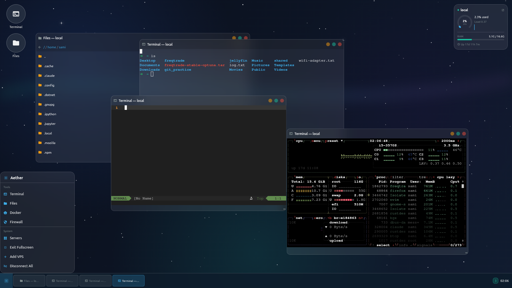

# Aether

A glassmorphic desktop environment for managing VPS servers over SSH — floating windows, live stats, terminal, file manager, Docker and firewall tools. Runs on Android and Linux.

---

## Features

- 🪟 Floating, draggable, resizable glass windows with a taskbar and start menu
- 📊 Live dashboard — CPU, memory, disk, network, load and uptime
- 💻 Full terminal emulator, plus Docker container shells and logs
- 📁 SFTP file manager — upload, download, rename, zip/unzip
- 🐳 Docker manager — start/stop/restart/pause containers, prune images
- 🔥 Firewall (UFW) manager with live open-port scan
- ⚙️ systemd service manager
- 🎨 Appearance settings — window opacity, blur intensity and dark glass tint, so windows stay readable on any wallpaper
- 🔐 Credentials in secure storage, optional biometric app lock

---

## Screenshots

| Server List | Desktop |
|-------------|---------|
|  |  |

---

## Download

| Platform | Link |
|----------|------|
| 📱 Android APK | [**Download APK**](../../releases/latest/download/aether.apk) |
| 🐧 Linux | [**Download Linux**](../../releases/latest/download/aether-linux.tar.gz) |

---

## Install

### Android
Tap the APK link above → open the file on your device → tap **Install**.
> Enable *Install unknown apps* in Android settings if prompted.

### Linux — one command
```bash
curl -fsSL https://raw.githubusercontent.com/saamy4r/aether/master/install.sh | sudo bash
```
Then just run: `aether`

### Windows
Must be built on a Windows machine — see [Build from Source](#build-from-source).

---

## SSH Setup

1. Open Aether → tap the prompt → **Add Server**
2. Enter your VPS IP, port, and username — choose **SSH Key**
3. Copy the public key the app shows you to your server:
```bash
echo "paste-key-here" >> ~/.ssh/authorized_keys
```
4. **Test Connection** → **Save**

---

## Build from Source

```bash
git clone https://github.com/saamy4r/aether.git
cd aether
flutter pub get
flutter run -d linux        # or: flutter run -d <android-device-id>
```

**Release builds:**
```bash
flutter build linux --release    # → build/linux/x64/release/bundle/
flutter build apk --release      # → build/app/outputs/flutter-apk/app-release.apk
flutter build windows --release  # Windows only — run on a Windows machine
```

**Linux deps:** `sudo apt install ninja-build cmake libgtk-3-dev pkg-config clang`

---

## License

MIT — see [LICENSE](LICENSE)
